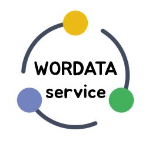

# WORDATA

---

각종 서비스에서 **개인화**란 키워드가 중시되고 있다. 개인화는 효율성 증대와 이어진다. 우리는 영어공부에서 큰 비중을 차지하는 **단어 공부**의 효율성을 높이기 위한 개인화 단어장을 계획하고 제작했다. 

기존 시장에 나와있는 단어장은 각종 시험에서 주로 나오는 단어에 대한 것이 대부분이다. 하지만 영어단어가 중요한 때는 시험을 볼 때가 아니라, 어떤 분야에 진입할 때라고 생각한다. 전공 공부를 시작할 때 원서를 읽어야 한다면 가장 발목을 잡는것이 그 분야의 전문 어휘들이다. 이런 어휘들을 처음 접하기에 초반 대부분의 시간이 그런 어휘를 사전에서 찾아보는데 시간을 할애하게 된다. 이런 초기 진입장벽을 낮출 수만 있다면 그 분야에 대한 진입 속도를 높일 수 있다 생각했다.

하지만 시장에는 특정 전공분야의 어휘를 효과적으로 공부할 수 있는 단어장이 출판되지 않고, 또 그런 단어장이 있다고해서 내가 꼭 필요한 단어들만 있지도 않다. 워다타는 사용자로부터 원서(논문, ebook 등)를 직접 입력받고 그 속에서 __유의미한__ 단어를 추출하고 사전과 연동하여 단어의 뜻, 예문, 해석을 제공한다. 

이 서비스를 사용하는 유저들의 영어 어휘 습득의 효율성을 높이길 기대한다.

---
+ 유저가 분석이 필요한 문서 입력
+ 텍스트 분석
+ 사전과 연계하여 자동으로 단어장 형식 생성

---
### 홍보 영상
<video src="./readme/video.mp4" controls autoplay></video>
